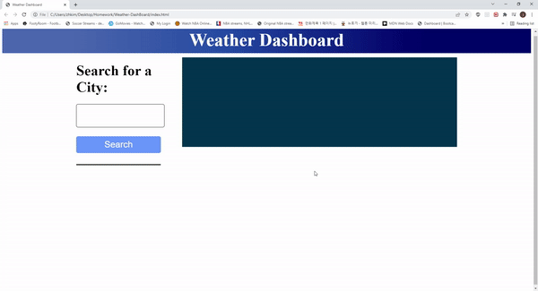

#  Weather Dashboard
<h1>Weather Dashboard</h1>
  
<p>EWeather Dashboard is a webpage where you can look up weathers for different places</p>
  
 ## User Story
 ```
AS A traveler
I WANT to see the weather outlook for multiple cities
SO THAT I can plan a trip accordingly
```

 <br>
  
</p>
  <h2>Table of Contents</h2>
  <ul> 
   <li><a href="#Usage">Usage</a></li>   
   <li><a href="#Contributing">Contributing</a></li>   
   <li><a href="#Questions">Questions</a></li>                         
  </ul>
  <h2 id="Installation">Installation</h2>                         
  <p>
  <ol>
<li>Clone this repository.<pre><code> git <span class="hljs-keyword">clone</span> <span class="hljs-title">https</span>://github.com/zhkim3/Weather-DashBoard.git
</code></pre></li>


</code></pre></li>
</ol>
  <h2 id="Usage">Usage</h2>
  <p>This application is to see the weathers in different cities. 
  <h2 id="Contributing">Contributing</h2>
  <p>Anyone is free to contribute to this application. Being an open source community makes the Dev community special. Any contributes are appreciated. </p>
  <h2 id="Questions">Questions</h2>
  <p style="strong">Any questions regarding this project, contact zhkim3@gmail.com directly.</p> 